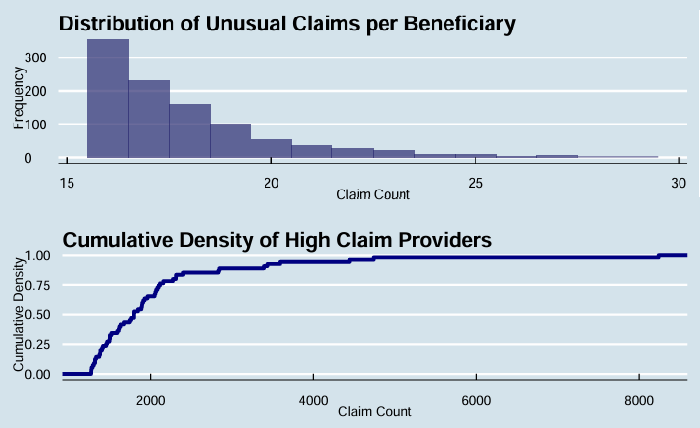
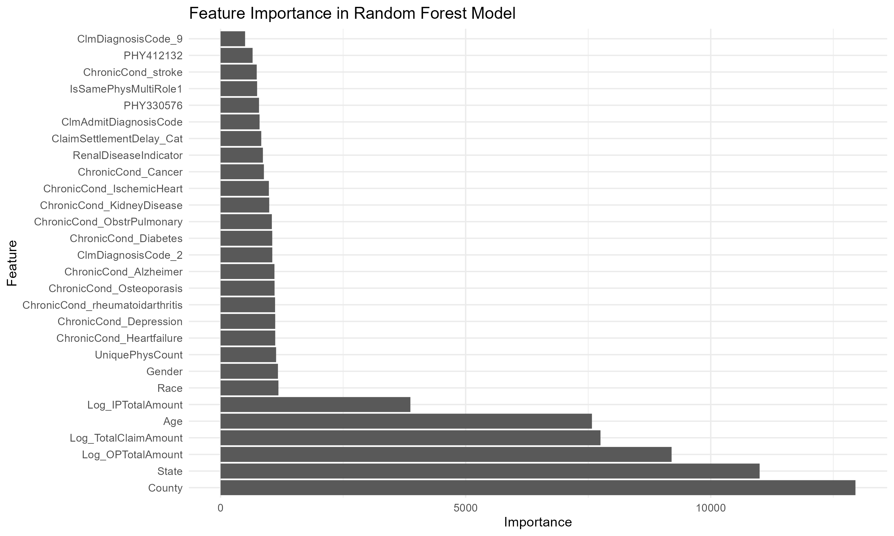
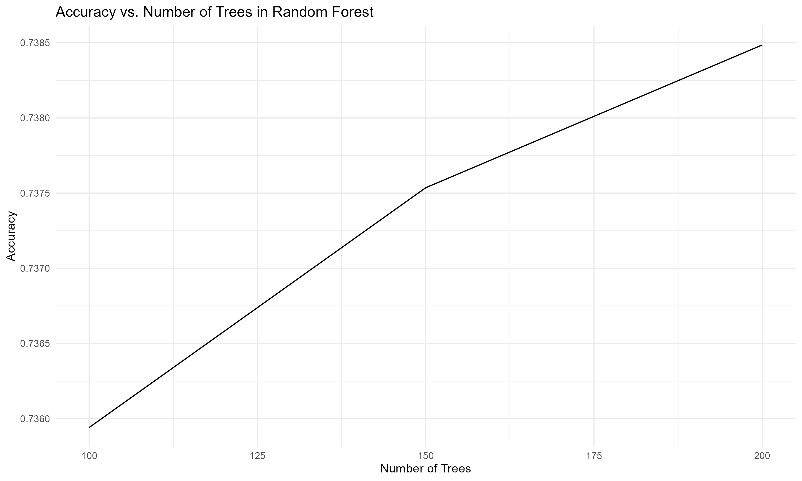

```{r echo = FALSE, include=FALSE}
# clear all variables, functions, etc
# clean up memory
rm(list=ls())
# clean up memory
gc()
```


```{r setup, include=FALSE}
knitr::opts_chunk$set(
  echo = TRUE, 
  fig.width = 8, 
  fig.asp = 0.618, 
  out.width = "80%",
  fig.align = "center", 
  root.dir = "../",
  message = FALSE,
  size = "small"
)
```


```{r warning=FALSE, include=FALSE}
pacman::p_load(tidyverse)
pacman::p_load(knitr,dplyr,AICcmodavg)
pacman::p_load(inspectdf,tidyr,stringr, stringi,DT,mice)
pacman::p_load(caret,modelr)
pacman::p_load(mlbench,mplot)
pacman::p_load(tidymodels,glmx)
pacman::p_load(skimr,vip,yardstick,ranger,kknn,funModeling,Hmisc)
pacman::p_load(ggplot2,ggpubr,GGally)
knitr::opts_chunk$set(message = FALSE)
```


```{r warning=FALSE, include=FALSE}
# Decision tree
pacman::p_load(rpart.plot)

# Data manipulation
pacman::p_load(rgl, rattle, mice, dplyr, tidyverse)

# Plotting
pacman::p_load(viridis, hrbrthemes, ggplot2, heplots, ggpubr, forcats)
```

```{r warning=FALSE, include=FALSE}
# Load data
data <- read.csv("data.csv", header = TRUE, sep = ",")
nrow(data)
names(data)
# head(data)
```


\newpage


---


## 1. Introduction

The healthcare insurance industry is currently grappling with the significant challenge of insurance fraud, which has notable impacts on costs and compromises trust between patients and stakeholders. In response, this report extends prior research endeavors, applying data mining and predictive analytics as proactive mechanisms for fraud detection. The primary focus is the development of a decision tree model, utilizing comprehensive data encompassing medical insurance claims, provider details, and indicators of fraud to strategically address fraudulent activities in healthcare insurance.

The foundational dataset for this analysis comprises four critical components:
- **Inpatient Data:** Encompasses hospital admission details, including admission and discharge dates, and diagnosis codes. These elements are vital for analyzing hospital stay durations and underlying reasons.
- **Outpatient Data:** Pertains to patients receiving medical care without extended hospitalization, including the nature and frequency of such services.
- **Beneficiary Details Data:** Provides insights into beneficiaries' medical history and affiliations, crucial for conducting region-specific analyses.
- **Provider Potential Fraud Data:** This dataset associates healthcare providers with potential fraudulent activities, categorized as 'Yes' for potential fraud and 'No' for non-fraudulent activities.

The dataset aggregates data from 138,556 beneficiaries, encompassing 558,211 claims and 5,410 providers. The analysis revealed an average of approximately 4.029 claims per beneficiary.

### Recap Section

Previous reports, informed by feedback from various academic studies, highlighted the significance of feature engineering, data balancing, and the strategic use of decision tree classifiers in fraud detection. Enhanced accuracy in predictive models was achieved through the careful creation and selection of informative features, including the exploration of newly labeled datasets for supervised learning. To counteract imbalanced datasets, methods like the Class Weighing Scheme and Adaptive Synthetic Oversampling were employed. The decision to use decision tree classifiers was based on their demonstrated high accuracy, thus reinforcing their application in the predictive modeling process.

Comprehensive data exploration and cleansing processes were essential steps in the study. This included the integration of different datasets and addressing missing data through Multiple Imputation by Chained Equations, ensuring robust preparation for the predictive models.

During the model-building phase, there was a meticulous fine-tuning of crucial decision tree parameters such as the complexity parameter (cp), minsplit, and maxdepth. The use of techniques like 10-fold cross-validation and grid search facilitated the optimal determination of these parameters. Feedback from previous studies underscored the necessity of a systematic approach in parameter selection, emphasizing the importance of tailored application of correlation methods across different variable types.


---


\newpage


## 2. Data Exploration and Feature Selection

### a. Plot Explanation


Figure 1 depicts two key analyses: the distribution of unusual claims per beneficiary (upper histogram) and the cumulative density of high claim providers (lower plot). The histogram demonstrates a skewed distribution, pinpointing a subset of beneficiaries with exceptionally high claim counts, suggestive of potential fraudulent activity. The cumulative density plot further identifies a small fraction of providers associated with an inordinately high number of claims. This intersection of high-claim beneficiaries and providers marks a critical area for fraud investigation, as indicated by the analysis beyond the 99th percentile.




**Figure 1.**Distribution of Unusual Claims per Beneficiary and Cumulative Density of High Claim Providers.


Alternative representations, such as box plots or scatter plots, were considered for their ability to highlight outliers and relationships among variables. However, the selected histogram and cumulative density plot were deemed most effective in emphasizing the extremities within the data, crucial for isolating potential fraudulent cases.

### b. Feature Selection Process

The feature selection process was a meticulous, data-driven endeavor, employing the Random Forest algorithm to determine feature importance. This involved several key steps:

- **Random Forest Importance Evaluation**: This technique revealed that geographical variables (`County`, `State`), claim amounts (`Log_OPTotalAmount`, `Log_TotalClaimAmount`), demographic factors (`Age`, `Gender`), and chronic conditions were among the most significant predictors.

- **Correlation Analysis**: A Pearson correlation analysis confirmed the absence of significant multicollinearity, allowing for the inclusion of diverse numeric variables without redundancy concerns.

- **Outlier Detection**: The necessity to identify and understand outliers was paramount, as shown in Figure 1, facilitating the discernment between potential fraud and legitimate extremes.

- **Variable Scaling**: Logarithmic transformations helped normalize the feature distributions, catering to algorithms that benefit from standardized data scales.

- **Algorithmic Feature Selection**: The Random Forest model's Gini impurity scores guided the feature selection, ensuring a focus on the most pertinent predictors. While a threshold was set at the 25th percentile of importance scores to identify less significant features, the final inclusion was determined by performance metrics across different modeling techniques.


```{r warning=FALSE, include=FALSE}
pacman::p_load(ranger)

# Identify the target variable and feature variables
target_variable <- "PotentialFraud"
feature_variables <- setdiff(names(data), target_variable)

# Define the formula for the random forest model
formula <- as.formula(paste(target_variable, "~ ."))

# Train the random forest model using ranger
rf_model <- ranger(formula,
                   data = data,
                   importance = 'impurity',  # This specifies to use Gini impurity for importance
                   num.trees = 100)

# Get the importance scores
importance_scores <- rf_model$variable.importance

# Create a data frame of the feature importance scores
importance_df <- data.frame(Feature = names(importance_scores), Importance = importance_scores)

# Order the features by importance
importance_df <- importance_df[order(-importance_df$Importance), ]
```

```{r warning=FALSE, include = FALSE}
# Print the top 5 features
print("Top 10 features based on Gini importance:")
print(head(importance_df, 10))
```


Figure 2 visualizes the ten most significant features ascertained by the Random Forest model. This visual representation underscores the features' varying degrees of importance, further informing the model refinement process. See **Appendix 1** for a detailed list of the selected features and their descriptions.

```{r warning=FALSE, echo=FALSE}

# Visualize the top 10 features based on Gini importance
top_n_features <- head(importance_df, 10)

# Create a bar plot
ggplot(top_n_features, aes(x = reorder(Feature, Importance), y = Importance)) +
    geom_bar(stat = "identity", fill = "steelblue") +
    coord_flip() +  # Flip coordinates for horizontal bars
    theme_minimal() +
    labs(title = "Top 10 Features Based on Gini Importance",
         x = "Features",
         y = "Importance Score") +
    theme(text = element_text(size = 12))
```
**Figure 2.** Top 10 Features Based on Gini Importance.


The feature selection methodology adopted was iterative and multifaceted, combining algorithmic assessment with domain-specific insights. This comprehensive approach ensured the development of a robust, interpretable model adept at navigating the complexities inherent in detecting healthcare insurance fraud.


---

\newpage

## 3. Classification Models

This section presents the development and evaluation of four classification models, each chosen for its strengths in handling the intricate aspects of healthcare insurance fraud detection. These models are Random Forests, Naïve Bayes, Neural Networks, and Ensemble Methods. The primary focus is on explaining the rationale behind each model's settings and analyzing their performance metrics.

To expand on the model evaluation and add depth to the discussion based on the detailed analysis provided, you can integrate the following insights:

**Random Forests**: The Random Forest model showcased strong performance with an accuracy of 73.62% and a post-tuning F1-score that indicates a good balance between precision and recall. This model's capacity for iterative improvement and its feature importance analysis suggest that it is adept at processing a large number of input variables and can be fine-tuned to reduce false positives—a critical aspect in the context of fraud detection where the cost of false alarms can be significant.

**Naïve Bayes**: Despite its high sensitivity, the Naïve Bayes model exhibited a notable deficiency in specificity, as reflected by its accuracy of 62.34% and balanced accuracy of 51.409%. Given these limitations, the model's value may lie in its use as a benchmark or as part of an ensemble approach where its high sensitivity could contribute to detecting more subtle patterns of fraudulent behavior when combined with other models.

**Neural Networks**: The moderate performance of the Neural Network model, with an accuracy of 64.17% and an F1-score of 46.32%, points to challenges in achieving a high true positive rate without an unacceptable increase in false positives. The complexity and flexibility of neural networks suggest potential for improvement, possibly through further hyperparameter tuning, exploration of different architectures, or the use of more advanced deep learning techniques.

**Ensemble Method (Stacked Model)**: The Ensemble Method stood out with an impressive accuracy of 82.95% and an AUC of 90.31%, signifying its strong discriminative power. This model's success is likely due to its ability to blend different models' strengths, thereby enhancing predictive accuracy and robustness. The feature importance analysis from this model emphasizes the weight of variables such as geographical location, claim amounts, and provider details, echoing findings across individual models and underscoring their relevance in predicting fraud.


In light of the specific challenges presented by healthcare fraud detection—such as large data volumes, imbalanced classes, and intricate data relationships—these models stand out as the most promising candidates. Each model will be evaluated based on key performance metrics to identify the most effective approach for our purposes. This evaluation will focus on a singular, optimal model representation from each method to ensure clarity and conciseness in reporting.

When comparing models, it's clear that while the Ensemble Method excels in overall performance, the unique strengths of individual models could be harnessed in specific scenarios. For instance, the Random Forests model's ability to identify key patterns could be valuable in preliminary data analysis or in settings where interpretability is a priority. The Neural Network model's capacity to model complex relationships might be particularly beneficial in scenarios with intricate data patterns. 


---

\newpage

### 3.1 Random Forest Model Development and Initial Evaluation


The Random Forest algorithm was selected for its robustness and effectiveness in handling the complex structure of large healthcare insurance fraud datasets. Key settings included the following and these settings were chosen to balance the model's capacity for accuracy and computational efficiency.

- **Target Variable**: `PotentialFraud`
- **Number of Trees (`num.trees`)**: 100
- **Number of Variables Tried at Each Split (`mtry`)**: Square root of the number of variables in the training set
- **Variable Importance**: Enabled with the `importance` parameter set to `'impurity'`


**Preliminary Model Performance**

The model's initial performance metrics provided promising results:

- **Accuracy**: 73.62%
- **Misclassification Rate**: Below 30%
- **Precision**: 75.20%
- **Recall**: 86.00%

These metrics were indicative of the model's potential effectiveness in fraud detection.

**Model Tuning and Performance Enhancement**

To improve performance, the model was fine-tuned by increasing the number of trees and adjusting the minimum node size. Post-tuning metrics showed enhancements in several areas, most notably in accuracy and precision.

**Table 1.** post-tuning performance metrics.

```{r, results='asis', echo=FALSE}
library(knitr)

performance_metrics <- data.frame(
  Metric = c("Accuracy", "Sensitivity", "Specificity", "Precision", "NPV", "Balanced Accuracy"),
  Post_Tuning = c("74.71%", "86.48%", "55.28%", "76.14%", "71.29%", "70.88%"),
  Improvement = c("Improved", "Slightly Decreased", "Improved", "Improved", "Improved", "Improved")
)

kable(performance_metrics, caption = "Table 2. Performance Metrics After Fine-Tuning", align = 'c', col.names = c("Metric", "Post-Tuning", "Change"))
```


The fine-tuning process was informed by the model's feature importance, which showed that certain predictors such as `County` wielded significant influence on the model's predictions. The reduction of features based on importance scores led to a more parsimonious model that improved on specificity without a significant trade-off in sensitivity.

The fine-tuned Random Forest model demonstrates an increased predictive performance. This model's ability to improve through iterative fine-tuning and the insights provided by feature importance analysis underscore its value in a complex and evolving industry landscape as it can reduce the number of false alarms that could potentially lead to unnecessary investigations. Its ability to process a large number of input variables and to provide a measure of feature importance makes it particularly useful for identifying key patterns indicative of fraudulent behavior.


\newpage


 



**Figure 3.**and **Figure 4.** provide visual representations of the features' impact on model performance and the trade-off between true positive rate and false positive rate.

---


### 3.2 Naïve Bayes Model Development and Initial Evaluation


For its speed and simplicity, the Naïve Bayes classifier was the next algorithm chosen for classification. Known for performing well with categorical data and high-dimensional datasets, it was considered a suitable method for the fraud detection dataset, which contained a significant number of categorical features.


The Naïve Bayes model was constructed with the `naiveBayes` function, applying the standard practice of data partitioning to create training and test datasets. The `PotentialFraud` variable was designated as the target outcome.

**Preliminary Model Performance**

Upon initial assessment, the Naïve Bayes model exhibited the following performance metrics:

- **Accuracy**: 62.34%
- **Sensitivity (Recall)**: 97.395%
- **Specificity**: 5.422%
- **Precision (Positive Predictive Value)**: 62.58%
- **Negative Predictive Value**: 56.17%
- **Balanced Accuracy**: 51.409%

Although the model demonstrated high sensitivity, it had considerable limitations in specificity, suggesting difficulties in accurately identifying fraudulent interactions.

**Model Tuning and Performance Enhancement**

The tuning of the Naïve Bayes model was restricted to feature selection and preprocessing, as the algorithm does not support hyperparameter optimization in the traditional sense. Attempts to refine the model using kernel density estimation did not yield performance improvements.

**Table 2.** shows the comparison of performance metrics before and after fine-tuning.

| Metric            | Pre-Tuning | Post-Tuning | Change         |
|-------------------|------------|-------------|----------------|
| Accuracy          | 62.34%     | 62.34%      | No Improvement |
| Sensitivity       | 97.395%    | 97.395%     | No Improvement |
| Specificity       | 5.422%     | 5.422%      | No Improvement |
| Precision         | 62.58%     | 62.58%      | No Improvement |
| Negative Predictive Value | 56.17% | 56.17% | No Improvement |
| Balanced Accuracy | 51.409%    | 51.409%     | No Improvement |


The model's consistency in performance before and after tuning suggests that for this dataset, Naïve Bayes may have reached its capacity in terms of predictive ability given the inherent assumptions and limitations of the algorithm.

The Naïve Bayes model, while beneficial for its computational efficiency and ease of implementation, faced challenges in effectively identifying fraudulent cases in the healthcare insurance fraud dataset. The model's high sensitivity was offset by its low specificity, indicating a potential need for alternative approaches to better address the complexity of fraud detection. Further investigations into model refinement, feature engineering, or alternative classification methods may be warranted to enhance detection performance.


---

\newpage


### 3.3 Neural Network Model Development and Initial Evaluation


For the neural network model, the flexibility and power of deep learning to handle the complex patterns inherent in healthcare insurance fraud data were leveraged.


The model was developed using Keras, a high-level neural networks API, running on top of TensorFlow. The development process involved several key steps:

1. **Data Preparation**: The data was split into training and test sets, with 80% of the data used for training and the remaining 20% for testing.
2. **Feature and Target Separation**: Features (`X_train`, `X_test`) and the target variable (`y_train`, `y_test`) were segregated.
3. **Model Architecture**: The model architecture was defined using Keras' Sequential model. It included layers such as Dense, Dropout for regularization, Batch Normalization, and LeakyReLU activation. A final Dense layer with a sigmoid activation function was used for binary classification.
4. **Hyperparameter Tuning**: Bayesian Optimization was employed to search for the best hyperparameters over a set number of trials, optimizing for validation accuracy.
5. **Class Weights**: Due to the imbalanced nature of the dataset, class weights were computed and applied to help the model learn from the underrepresented class.
6. **Callbacks**: EarlyStopping was used to prevent overfitting, and TensorBoard was employed for experiment tracking.
7. **Model Training**: The model was trained with the best hyperparameters, using a validation split of 20% during training.

**Preliminary Model Performance**

The model's performance was evaluated on the test set using standard classification metrics:

- **Accuracy**: 64.17%
- **Precision**: 53.68%
- **Recall**: 40.73%
- **F1-Score**: 46.32%


The confusion matrix for the test predictions was as follows:

**Table 3.** Confusion Matrix for Neural Network Model.


|       | Predicted No Fraud | Predicted Fraud |
|-------|--------------------|-----------------|
| Actual No Fraud | 54,388            | 14,891          |
| Actual Fraud    | 25,109            | 17,255          |


The neural network's performance indicated a reasonable ability to classify, but there was room for improvement, particularly in terms of recall and precision. The F1-Score, a balance between precision and recall, was moderate, indicating the model's challenges in achieving a high true positive rate without increasing false positives.

The deep learning model, with its nuanced architecture and ability to capture complex relationships in the data, demonstrated potential in detecting fraudulent cases. However, the balance between sensitivity and specificity highlighted the need for further refinement. 


---


\newpage


### 3.4 Ensemble Method Model Development and Initial Evaluation

The ensemble method, specifically designed as a stacked model, was developed to enhance predictive performance in healthcare insurance fraud detection. This approach combined the predictive capabilities of individual models into a more robust and accurate system.


The development of the ensemble model involved the following steps:

1. **Base Model Training**: Two base models were trained using XGBoost, a powerful and efficient implementation of gradient boosted trees. The training involved a detailed hyperparameter tuning process using a grid search approach. Key parameters included `max_depth`, `min_child_weight`, `gamma`, `subsample`, `colsample_bytree`, and `eta`. A total of 243 different parameter combinations were evaluated to find the optimal model settings.

2. **Hyperparameter Selection**: The best model was chosen based on the mean AUC (Area Under the Curve) score from cross-validation results. The chosen parameters were `max_depth = 10`, `min_child_weight = 6`, `gamma = 0`, `subsample = 0.8`, `colsample_bytree = 0.8`, and `eta = 0.05`. These parameters control various aspects of the model:
   
   - `max_depth`: Defines the maximum depth of the trees. Deeper trees can capture more complex patterns but risk overfitting.
  
   - `min_child_weight`: Helps prevent overfitting by setting the minimum sum of instance weight (hessian) needed in a child.

   - `gamma`: Controls regularization (or pruning), with higher values leading to more conservative models.

   - `subsample` and `colsample_bytree`: These parameters manage the sampling of the dataset that prevents overfitting.


   - `eta`: The learning rate, determining the step size at each iteration and hence the convergence rate.

    `The best hyperparameter set was selected based on the performance metric, the mean AUC score, from cross-validation.`

3. **Meta-Model Training**: The predictions from the XGBoost base models were used as features for a Random Forest meta-model. Random Forest, an ensemble method itself, aggregates the decisions from multiple decision trees to improve the model's generalization capability. This layering of models is the essence of the stacking technique.

4. **Feature Importance Analysis**: Feature importance was extracted from both the base models and the meta-model to understand which predictors were most influential in detecting fraud.


**Ensemble Model Performance Evaluation**

The performance of the stacked ensemble model was evaluated using standard classification metrics:

- **Accuracy**: 82.95%
- **Precision**: 82.21%
- **Recall**: 70.71%
- **F1-Score**: 76.03%
- **AUC**: 90.31%


```{r warning=FALSE, echo=FALSE}
library(ggplot2)

# Assuming conf_matrix_meta is your confusion matrix
conf_matrix_meta <- matrix(c(31220, 3265, 6250, 15087), nrow = 2, byrow = TRUE,
                           dimnames = list('Predicted' = c('0', '1'), 'Actual' = c('0', '1')))

# Convert the matrix to a data frame for plotting
conf_matrix_meta_df <- as.data.frame(as.table(conf_matrix_meta))

# Plot using ggplot2
ggplot(data = conf_matrix_meta_df, aes(x = Actual, y = Predicted, fill = Freq)) +
  geom_tile() +
  geom_text(aes(label = sprintf("%d", Freq)), vjust = 1) +
  scale_fill_gradient(low = "#ffffff", high = "#343488") +
  labs(title = "Confusion Matrix Heatmap",
       x = "Actual Category",
       y = "Predicted Category",
       fill = "Count") +
  theme_minimal() +
  theme(axis.text.x = element_text(angle = 45, hjust = 1))
```
**Figure 5.** Confusion Matrix Heatmap for the Stacked Ensemble Model.


These metrics provided a holistic view of the model's performance. High precision and recall indicated the model's effectiveness in identifying fraudulent cases correctly. The F1-score, a harmonic mean of precision and recall, provided a single metric that balances both. A high AUC value reflected the model's ability to discriminate between fraudulent and non-fraudulent cases effectively.

These metrics were significantly better than the original XGBoost models, indicating the effectiveness of the ensemble approach. The high AUC value, in particular, demonstrated the model's ability to distinguish between fraudulent and non-fraudulent cases.


**Interpretation and Insights**

- The ensemble method's improved accuracy and AUC highlight its efficacy in handling the complexities of fraud detection in healthcare insurance.
- The feature importance analysis from the Random Forest meta-model provided insights into which features were most critical in predicting fraud.
- The combination of different model predictions into a meta-model helped in reducing overfitting and enhancing the overall robustness of the prediction.

The stacked ensemble model, by combining the predictive power of individual XGBoost models into a Random Forest meta-model, showcased superior performance in detecting potential fraud cases. This approach effectively harnessed the diverse strengths of different algorithms, leading to a more robust and accurate fraud detection system. The high AUC value and the significant improvements in precision and recall underscore the model's practical applicability in a complex domain like healthcare insurance fraud detection.


---


```{r warning=FALSE, include=FALSE}
pacman::p_load(xgboost)

# Load from CSV files
train <- read.csv("train_important.csv")
validation <- read.csv("validation_important.csv")
test <- read.csv("test_important.csv")
```

```{r warning=FALSE, include=FALSE}

library(randomForest)

model1 <- readRDS("best_model_em.rds")
model2 <- readRDS("best_model_em2.rds")


# Prepare your new data for prediction (assuming "test" is your new dataset)
dnew <- xgb.DMatrix(data = as.matrix(test[,-ncol(test)]))

# Generate predictions from the base models on the new data
base_model_preds_new1 <- predict(model1, dnew)
base_model_preds_new2 <- predict(model2, dnew)

# Combine the base model predictions with the new data
stacked_predictions_new <- data.frame(
  model1_preds = base_model_preds_new1,
  model2_preds = base_model_preds_new2,
  PotentialFraud = test$PotentialFraud  # Include the target variable for the new data
)

# Train the Random Forest as the Meta-Model
meta_model_rf <- randomForest(PotentialFraud ~ ., data = stacked_predictions_new, family = binomial())


```


```{r warning=FALSE, include=FALSE}
library(pROC)

# Make predictions with the stacked ensemble model
meta_preds_test <- predict(meta_model_rf, newdata = stacked_predictions_new, type = "response")
meta_pred_labels <- ifelse(meta_preds_test > 0.5, 1, 0)  # Assuming 0.5 as the threshold

# Calculate metrics for the stacked ensemble model
conf_matrix_meta <- table(Predicted = meta_pred_labels, Actual = test$PotentialFraud)
accuracy_meta <- sum(diag(conf_matrix_meta)) / sum(conf_matrix_meta)
precision_meta <- conf_matrix_meta[2,2] / sum(conf_matrix_meta[2,])
recall_meta <- conf_matrix_meta[2,2] / sum(conf_matrix_meta[,2])
f1_score_meta <- 2 * precision_meta * recall_meta / (precision_meta + recall_meta)

# For AUC of the stacked ensemble model
roc_obj_meta <- roc(response = test$PotentialFraud, predictor = meta_preds_test)
auc_value_meta <- auc(roc_obj_meta)

# Print the metrics for the stacked ensemble model
print("Stacked Ensemble Model Metrics:")
print(conf_matrix_meta)
print(paste("Accuracy:", round(accuracy_meta, 4)))
print(paste("Precision:", round(precision_meta, 4)))
print(paste("Recall:", round(recall_meta, 4)))
print(paste("F1-Score:", round(f1_score_meta, 4)))
print(paste("AUC:", round(auc_value_meta, 4)))

```


\newpage


## 4. Model Comparison and Conclusion

This section compares and contrasts the performance of the four evaluated models - Random Forests, Naïve Bayes, Neural Networks, and an Ensemble Method - to identify the most effective tool for detecting fraudulent activities in healthcare insurance.

**Model Performance Summary**

Each model was assessed based on key performance metrics, with the Ensemble Method emerging as the superior choice. A comparative snapshot reveals:

- **Random Forests**: Showed promising results with an accuracy of 73.62% and an improved F1-score post-tuning.
- **Naïve Bayes**: Exhibited limitations, particularly in specificity, with an accuracy of 62.34% and a balanced accuracy of 51.409%.
- **Neural Networks**: Demonstrated moderate performance with an accuracy of 64.17% and an F1-score of 46.32%.
- **Ensemble Method (Stacked Model)**: Excelled with an accuracy of 82.95%, precision of 82.21%, and an impressive AUC of 90.31%, demonstrating its robustness in classification.

The Ensemble Method's superior performance can be attributed to its advanced approach in combining the strengths of individual models, thereby enhancing predictive accuracy and reducing overfitting.


**Feature Importance Analysis**

The analysis conducted on the Ensemble Method's components revealed key insights:

1. **Random Forest Meta-Model**: Illustrated in Figure 6, the plot underscored the relative impact of the 2 model in the meta-model.The two base model having different importance scores, Base Model 2 is more important than Base Model 1.


```{r warning=FALSE, include=FALSE}
# Extract feature importance
feature_importance_rf <- importance(meta_model_rf)
```


```{r warning=FALSE, echo=FALSE}
# Convert to a data frame for plotting
importance_df_rf <- data.frame(Feature = rownames(feature_importance_rf), Importance = feature_importance_rf[,1])
library(ggplot2)
ggplot(importance_df_rf, aes(x = reorder(Feature, Importance), y = Importance)) +
  geom_bar(stat = "identity") +
  coord_flip() +  # For better readability of feature names
  theme_minimal() +
  labs(title = "Feature Importance in Random Forest Meta-Model", x = "Feature", y = "Importance")
```
**Figure 6.** Feature Importance Plot for the Random Forest Meta-Model.


\newpage


2. **XGBoost Base Models**: Feature importance plots for both base models (Figures 7 and 8) provided insights into the features that were crucial in their respective predictive frameworks.


```{r warning=FALSE, echo=FALSE}
library(xgboost)
library(ggplot2)

# Assuming model1 and model2 are your XGBoost models

# Feature importance for model1
importance_model1 <- xgb.importance(feature_names = colnames(dnew), model = model1)
# Plotting
xgb.plot.importance(importance_matrix = importance_model1, top_n = 10)  # top_n for top 10 features
```
**Figure 7.** Feature Importance Plot for the XGBoost Base Model 1.

Figure 7 illustrates the feature importance for the first XGBoost base model. It shows that the most significant predictor is 'State', followed by 'County'. This indicates that geographical location plays a crucial role in the model's decision-making process, perhaps due to regional variations in fraud occurrence or claim patterns. The 'Log_TotalClaimAmount' feature also stands out, suggesting that the magnitude of the claims is a strong indicator of potential fraud. Features such as 'UniquePhysCount', indicating the count of unique physicians, and specific provider identifiers ('PHY330576' and 'PHY412132') are also influential, which may reflect the relevance of provider behavior in predicting fraud.


Figure 8 represents the feature importance for the second XGBoost base model. In this model, 'State' and 'County' remain the top two features, reinforcing the significance of geographical factors. However, there are additional features such as 'ClmAdmitDiagnosisCode' and 'ClmDiagnosisCode_9', which are related to diagnostic codes used in claims. Their presence suggests that certain diagnoses or patterns in diagnostic coding are predictive of fraud. The 'Log_IPTotalAmount', representing the logarithm of inpatient claim amounts, appears here as a lesser but still relevant feature, implying that inpatient claim amounts also have a role in predicting fraudulent activity.


\newpage


```{r warning=FALSE, echo=FALSE}

# Feature importance for model2
importance_model2 <- xgb.importance(feature_names = colnames(dnew), model = model2)
# Plotting
xgb.plot.importance(importance_matrix = importance_model2, top_n = 10)  # top_n for top 10 features
```
**Figure 8.** Feature Importance Plot for the XGBoost Base Model 2.


Comparing the two figures, while there is a common emphasis on geographical factors and total claim amounts, there are some differences. For instance, the first model does not prioritize diagnosis codes as highly as the second. This could be due to different interactions captured in the models or variance in the underlying data subsets they were trained on.

Overall, these plots underscore that while some predictors are consistently deemed important across models, others may vary, reflecting different aspects of the data that each model has learned to associate with the likelihood of fraudulent activity. The ensemble method, by leveraging these different perspectives, likely gains a more holistic view, which contributes to its superior performance as indicated in the broader analysis.


**ROC Curve Analysis**

The ROC Curve for the Stacked Ensemble Model (Figure 9) showcased its excellent capability in distinguishing between the fraudulent and non-fraudulent cases, emphasizing its suitability for complex fraud detection scenarios.

```{r warning=FALSE, echo=FALSE}
# plot the ROC curve
plot(roc_obj_meta, col = "#343488", lwd = 2, main = "ROC Curve for Stacked Ensemble Model")
```
**Figure 9.** ROC Curve for the Stacked Ensemble Model.


### Conclusion and Recommendation


The Ensemble Method, combining XGBoost base models with a Random Forest meta-model, proved to be the most effective for detecting fraudulent activities. Its high accuracy, precision, recall, and AUC scores underscore its capability as a robust, reliable tool for healthcare insurance fraud detection.

Insights from the feature importance analysis suggest that future data collection and preprocessing should prioritize the most influential features to enhance model accuracy further. This model's sophistication, coupled with its impressive performance metrics, positions it as the recommended choice for this predictive analytics task. It exemplifies the effectiveness of leveraging diverse machine learning techniques to address complex challenges such as fraud detection in healthcare insurance.

Moving forward, exploring additional ensemble techniques or incorporating newer algorithms could provide further improvements, adapting to the evolving nature of fraud detection challenges.


\newpage

---


## References: 

[1] A. Bhardwaj, S. Kumar and A. Naidu, "Predictive analysis and supervised detection for fraudulent cases in healthcare," 2022 12th International Conference on Cloud Computing, Data Science & Engineering (Confluence), Noida, India, 2022, pp. 416-421, doi: 10.1109/Confluence52989.2022.9734195.

[2] V. Rawte and G. Anuradha, "Fraud detection in health insurance using data mining techniques," 2015 International Conference on Communication, Information & Computing Technology (ICCICT), Mumbai, India, 2015, pp. 1-5, doi: 10.1109/ICCICT.2015.7045689.


[3] J. M. Johnson and T. M. Khoshgoftaar, "Healthcare Provider Summary Data for Fraud Classification" 2022 IEEE 23rd International Conference on Information Reuse and Integration for Data Science (IRI), San Diego, CA, USA, 2022, pp. 236-242, doi: 10.1109/IRI54793.2022.00060.

[4] N. Agrawal and S. Panigrahi, "A Comparative Analysis of Fraud Detection in Healthcare using Data Balancing & Machine Learning Techniques" 2023 International Conference on Communication, Circuits, and Systems (IC3S), BHUBANESWAR, India, 2023, pp. 1-4, doi: 10.1109/IC3S57698.2023.10169634.

[5] V. K et al., "Predicting health insurance claim frauds using supervised machine learning technique" 2023 Eighth International Conference on Science Technology Engineering and Mathematics (ICONSTEM), Chennai, India, 2023, pp. 1-7, doi: 10.1109/ICONSTEM56934.2023.10142604.

\newpage


---


## Appendix 1


**Table 1:** Features Selected for Model Building.
```{r table1, echo=FALSE, results='asis'}
library(knitr)

table_data <- data.frame(
  Feature_Name = c("AdmitCode", "DiagnosisCode_*", "Gender", "Race", "DiseaseIndicator", 
                   "State, County", "ChronicCond_*", "PotentialFraud", "Age", "Admission", "IsDead", 
                   "ClaimDelay", "Duration", "ClaimAmount, TotalAmount",
                   "Log_*", "UniquePhys, PhysRole", "SamePhys", "PHY*"),
  Description_Reason = c("Binary variable indicating if a claim admission diagnosis code is present. Helpful in identifying the primary reason for medical services.",
                         "Binary variables representing different claim diagnosis codes. Provide insights into types of medical conditions and may associate with fraudulent claims.",
                         "Binary representation of gender. Might affect medical service utilization patterns.",
                         "Categorical variable for racial categories. Different racial groups might have different medical needs.",
                         "Indicates presence or absence of renal disease. Patients with this might have specific medical service utilization patterns.",
                         "Represent geographical locations. Geographical patterns might emerge in fraudulent activities.",
                         "Series of binary variables for various chronic conditions. Influence type and frequency of required medical services.",
                         "Binary variable for potential fraud. Target variable for a fraud detection task.",
                         "Represents age of beneficiaries. Different age groups might have different utilization patterns.",
                         "Indicates if admission was during a weekend. Might see different types of claims or emergencies.",
                         "Binary variable indicating if beneficiary is deceased. Might influence kind of services rendered.",
                         "Categorical variable for claim settlement delay. Delays might indicate complications or disputes.",
                         "Duration of treatment. Longer durations might associate with more severe conditions.",
                         "Amounts related to claims. High or unusual amounts might be red flags for fraudulent activities.",
                         "Log-transformed values of features to normalize skewed distributions.",
                         "Numeric values for count of unique physicians and their roles. Multiple roles or frequent changes might be suspicious.",
                         "Indicates if the same physician plays multiple roles. Might indicate a lack of specialization or potential fraud.",
                         "Binary variables for specific physician identifications. Specific physicians might associate with specific types of claims.")
)

kable(table_data, col.names = c("Feature Name", "Description & Reason for Selection"))
```
