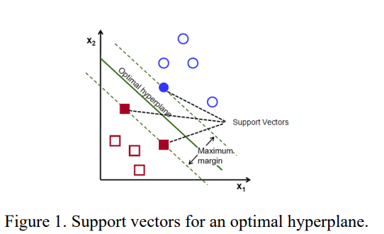

```{r echo = FALSE, include=FALSE}
# clear all variables, functions, etc
# clean up memory
rm(list=ls())
# clean up memory
gc()
```


```{r setup, include=FALSE}
knitr::opts_chunk$set(
  echo = TRUE, 
  fig.width = 8, 
  fig.asp = 0.618, 
  out.width = "80%",
  fig.align = "center", 
  root.dir = "../",
  message = FALSE,
  size = "small"
)
```


```{r warning=FALSE, include=FALSE}
pacman::p_load(tidyverse, gglm)
pacman::p_load(knitr,dplyr,AICcmodavg)
pacman::p_load(inspectdf,tidyr,stringr, stringi,DT)
pacman::p_load(caret,modelr)
pacman::p_load(mlbench,mplot)
pacman::p_load(tidymodels,glmx)
pacman::p_load(skimr,vip,yardstick,ranger,kknn,funModeling,Hmisc)
pacman::p_load(ggplot2,ggpubr,ggthemes,gridExtra,scales)
knitr::opts_chunk$set(message = FALSE)
```


```{r warning=FALSE, message=FALSE}
# Load libraries
pacman::p_load(pscl, ROCR, glmnet,mice,rpart,pROC)
# for cross validation
pacman::p_load(caret,rpart.plot)

pacman::p_load(class, mlr3, mlr3learners, mlr3measures, C50)
```


Support Vector Machine (SVM) 

Understand basic principles behind SVM.
• Implement SVM (with linear kernel) using R.
• Tune parameters for SVM with linear kernel.
• Tune parameters for SVM with polynomial kernel.
• Tune parameters for SVM with rbf kernel.


## Task1. Introduction to SVM

In very simple terms, the main idea of SVM is to find an optimal hyperplane that maximizes the margin between two classes. This hyperplane is simply a line in 2D space (if you plot two features like we did last week), plane in 3D and hyperplane when we have more than three dimensions.

Support vectors are data points that support hyperplane on either side, as displayed below (Figure 1).




SVM uses different kernels in case of non-linearly separable data points. Different kernel
functions transform the data into a higher dimensional feature space to make it possible to
perform the linear separation. Depending on the library you use, there are various
implementations of the SVM kernel, including polynomial, Gaussian, Gaussian radial basis
function (RBF), Laplace RBF, hyperbolic tangent, sigmoid, and linear kernel.

When working with the linear kernel there is only one parameter we should configure - C or
regularization parameter. Can you explain what would happen when you have large C? What
about when using very small C?

### Linear Kernel and Regularization Parameter (C) in SVM

#### Basic Understanding:
Support Vector Machines (SVM) are supervised learning algorithms designed for classification and regression tasks. The regularization parameter $ C $ controls the trade-off between maximizing the margin between classes and minimizing the classification error on the training set.

#### Technical Details:
The parameter $ C $ is crucial in determining the flexibility of the decision boundary. It essentially dictates the degree to which SVM should allow misclassification.

1. **Large C Value**:
    - **Low Bias, High Variance**: A large $ C $ makes the optimization focus on correctly classifying each data point, even at the expense of a potentially convoluted decision boundary.
    - **Overfitting**: It is highly susceptible to noise and outliers in the training set, leading to overfitting.
    - **Narrow Margin**: The margin, which is the distance between the closest points of different classes, will be narrower.
    - **Optimization**: Solving the optimization problem may become computationally expensive due to the complex decision boundary.

2. **Small C Value**:
    - **High Bias, Low Variance**: A small $ C $ means the algorithm is less concerned with misclassifying some training examples, favoring a smoother and simpler decision boundary.
    - **Underfitting**: The model may become too generalized and perform poorly on unseen data.
    - **Wide Margin**: The margin between classes will be wider.
    - **Optimization**: Generally quicker to compute due to the simpler boundary.

#### Significance:
Choosing an appropriate $ C $ is essential for model performance. While small $ C $ values may provide faster computation and a more generalized model, they risk underfitting. Conversely, large $ C $ values offer precise training classification but can lead to overfitting and increased computational costs.

#### Applications:
Model selection techniques like cross-validation can be employed to find the optimal $ C $ value for specific tasks. Grid search and randomized search are commonly used methods to tune $ C $ efficiently.


## Task2. Implement SVM (with linear kernel) using R


```{r}
# Load libraries
pacman::p_load(e1071, caret, ggplot2, GGally, kernlab)
```


At the end this practical, we will compare results we obtained with other three classifiers (rule-based, kNN and Naïve Bayes) versus SVM.

```{r}
# Load data
data <-read.csv(url("https://raw.githubusercontent.com/sreckojoksimovic/infs5100/main/wine-data.csv"))
```

make sure outcome variable is in the right format

```{r}
data$quality_class <- as.factor(data$quality_class)
```

summarize the obtained dataset.

```{r}
# Data input validation
head(data)
summary(data)
```

split the data into training and testing sets.

```{r}
# Split data into training and test datasets. We will use 70%/30% split
# again.
set.seed(123)
dat.d <- sample(1:nrow(data),size=nrow(data)*0.7,replace = FALSE) #random selection of 70% data.
train.data <- data[dat.d,] # 70% training data
test.data <- data[-dat.d,] # remaining 30% test data
head(train.data)
head(test.data)
nrow(train.data)
nrow(test.data)
```

Building an SVM model using the linear kernel is rather straightforward.

```{r}
# Build SVM model using linear kernel
svm.model <- svm(quality_class ~ ., data = train.data, kernel = "linear")
```

To be able to obtain a confusion matrix and calculate model parameters, we will call predict
function on the test data. Please note that here we are removing class variable, as that is what we are trying to predict.

```{r}
svm.pred = predict(svm.model,test.data[, -12])
```

obtain the confusion matrix.

```{r}
svm.results = confusionMatrix(table(predicted = svm.pred,
              actual = test.data$quality_class))
svm.results
```

We mentioned in the lecture that we should always tune SVM parameters to find an optimal model. Also, as we can see above that although the accuracy is considerably high, Kappa value is 0. Looking into the confusion matrix, it is obvious that this classifier simply assigns 0 to each data instance. 

One way to tune parameters for SVM with linear kernel would be as follows:

```{r}
# Parameter tuning – linear kernel
set.seed(999)
svm.linear.tune = tune.svm(quality_class~.,
    data=train.data,
    kernel="linear",
    cost=c(0.001, 0.01, 0.1, 1, 5, 10)) # cost parameter
summary(svm.linear.tune)
```

setting different values for the cost parameter. Once we finish, we can use the parameters for the best model .

```{r}
# Optimal model for linear kernel
svm.best.linear = svm.linear.tune$best.model
svm.tune.linear.pred = predict(svm.best.linear, newdata=test.data[, -12])
confusionMatrix(svm.tune.linear.pred, test.data$quality_class)
```

Not much has changed, compared to the first model we tried.
That is why we will test other kernels. In this practical, we will explore polynomial and rbf
kernels.


## Task 3. SVM in R - polynomial and rbf kernels

Finding an optimal model for polynomial and rbf kernels is quite similar to what we had for
the linear kernel. If you would like to explore what are the parameters that we need to configure for each kernel, you can run ?tune.svm() in R console.

```{r}
# Parameter tuning – polynomial kernel
set.seed(999)
svm.poly.tune = tune.svm(quality_class~., data=train.data,
                kernel="polynomial",
                degree=c(3,4,5), coef0=c(0.001, 0.01, 0.1, 1, 5, 10))
summary(svm.poly.tune)
```

we can obtain the confusion matrix.


```{r}
svm.best.poly = svm.poly.tune$best.model
svm.tune.poly.pred = predict(svm.best.poly, newdata=test.data[, -12])
confusionMatrix(svm.tune.poly.pred, test.data$quality_class)
```

As we can notice, model parameters look much better now.
We will repeat the same process for the rbf kernel.

```{r}
# Parameter tuning – rbf kernel
set.seed(999)
svm.rbf.tune = tune.svm(quality_class~., data=train.data,
               kernel="radial",
               gamma=c(0.001, 0.1, 0.5, 1, 5, 10))
summary(svm.rbf.tune)
```

run the model evaluation.


```{r}
svm.best.rbf = svm.rbf.tune$best.model
svm.tune.rbf.pred = predict(svm.best.rbf, newdata=test.data[, -12])
confusionMatrix(svm.tune.rbf.pred, test.data$quality_class)
```

Observing all the models we built today (SVM with linear, polynomial, and rbf kernels) and in
Practical 8 (rule-based, kNN, and Naïve Bayes), which model achieved the best performance?


## Sigmoid Kernel in SVM

Challenge 1. We talked about three kernels in this practical. Another commonly used
is sigmoid kernel.
Can you try to run the above procedure (finding an optimal model and running the model
evaluation) for sigmoid kernel?
Please note that for the sigmoid kernel, you should optimize values for gamma and coef0
parameters.

Parameter Tuning for Sigmoid Kernel:
```{r}
set.seed(999)
svm.sigmoid.tune = tune.svm(quality_class~., data=train.data,
               kernel="sigmoid",
               gamma=c(0.001, 0.01, 0.1, 1, 10),
               coef0=c(-1, 0, 1))
summary(svm.sigmoid.tune)
```

Train and Evaluate the Optimal Sigmoid Kernel SVM Model:

```{r}
svm.best.sigmoid = svm.sigmoid.tune$best.model
svm.tune.sigmoid.pred = predict(svm.best.sigmoid, newdata=test.data[, -12])
confusionMatrix(svm.tune.sigmoid.pred, test.data$quality_class)
```


#### Main Concepts:
The Sigmoid kernel is often used in Support Vector Machines (SVM) as one of the alternatives to linear, polynomial, or RBF kernels. Mathematically, the sigmoid kernel is defined as \(K(x, y) = \tanh(\gamma \langle x, y \rangle + c_0)\), where \( \gamma \) is the scale parameter and \( c_0 \) is the coefficient \( \text{coef0} \).

  

#### Technical Considerations:
- **Gamma (\( \gamma \))**: The scale parameter; a small value will yield a more flexible decision boundary, while a large value will yield a more rigid decision boundary.
- **Coef0 (\( c_0 \))**: The independent coefficient; this impacts how the input data is scaled before the sigmoid function is applied. 

#### Significance:
Choosing optimal parameters for the Sigmoid kernel can substantially influence model performance. It's essential to tune both `gamma` and `coef0` to avoid overfitting or underfitting.

#### Applications:
Like other kernels, the sigmoid kernel can be applied in various classification tasks. However, it's worth noting that sigmoid kernels have lost popularity compared to RBF kernels due to their behavior and output range.

